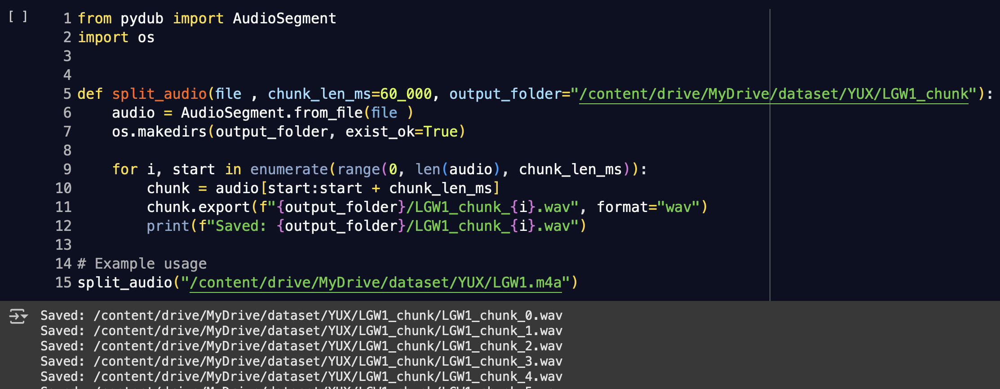

## Automated speech Recognition and sentiment Analysis

### Step 1. Automated speech Recognition
**Abstract**

This project is conducted as part of the Natural Language Processing (NLP) course at the Dakar Institute of Technology. The objective is to perform sentiment analysis on audio data using Automatic Speech Recognition (ASR). The proposed approach first processes spoken language through ASR to generate textual transcriptions. Sentiment analysis is then applied to the transcribed text to determine the emotional tone of the speech. This study aims to enhance the understanding of dialects, accents, and contextual variations, ensuring accurate transcription even in challenging acoustic environments. The findings contribute to improving speech-based sentiment analysis, particularly in diverse linguistic settings.

## Introduction

Automatic Speech Recognition (ASR) applications have increased greatly during the last decade due to the  emergence of new devices and home automation hardware that can benefit greatly from allowing users to interact hands free, such as smart watches, earbuds, portable translators, and home assistants.

Developers across many industries now use automatic speech recognition (ASR) to increase business productivity, application efficiency, and even digital accessibility. This post discusses ASR, how it works, use cases, advancements, and more.


**Automatic Speech Recognition (ASR)** involves converting spoken language into written text. It is designed to transcribe spoken words into text in real-time, allowing people to communicate with computers, mobile devices, and other technology using their voice.

## Use Cases for automatic speech transcription

* A person with English as a second language

Use case: A person with English as a second language needs transcriptions of audio content, so that he can better understand it.

* A web publisher looking to add captions to video

A content creator of publicly available web content, needs transcript of audio content, so that he can save time and effort when creating video captions and transcripts. ASR can cut down the time required to produce captions, but the results still need to be edited by a human.obtaining an auto-generated transcript of a song or podcast on Spotify

* A researcher working with interviews

As a researcher, I need a rough transcript of interviews so that I can save time producing final transcripts. ASR can save time, but the results still need to be edited by a human.

## Model


**1. Wav2Vec2** 

Facebook: Wav2Vec2-Large-XLSR-53-French (facebook/wav2vec2-large-xlsr-53-french) Wav2Vec 2.0 is a self-supervised learning model developed by Facebook AI (now Meta AI) for automatic speech recognition (ASR). The facebook/wav2vec2-large-xlsr-53-french model is a fine-tuned version of Wav2Vec2, specifically trained for French speech recognition.

The Wav2Vec 2.0 architecture is based on a transformer encoder and a CNN feature extractor: The model was fine-tuned on labeled French speech datasets. The large Model has 317 million parameters, 24 transformer layers and 16 attention heads. The base XLSR-53 model was pretrained on Multilingual Speech Data from 53 languages using 2.4 million hours of unlabeled audio. Trained on 53 languages, allowing transfer learning for low-resource languages.

**Advantage**: 

- End-to-End ASR: Works directly on raw audio without requiring feature engineering.
- Robust to Noisy Data: Performs well in real-world noisy environments.
- Efficient Fine-Tuning: Requires less labeled data compared to traditional ASR models.

**2. WHisper:**
 WHisper : is a pre-trained model for automatic speech recognition (ASR) published in September 2022 by the authors Alec Radford et al. from OpenAI. Unlike many of its predecessors, such as Wav2Vec 2.0, which are pre-trained on un-labelled audio data, Whisper is pre-trained on a vast quantity of labelled audio-transcription data, 680,000 hours to be precise

Whisper is designed for transcription, translation, and language identification, making it one of the most accurate and versatile ASR models available. Whisper learns directly from raw audio, making it more robust to noise, accents, and multilingual input.
advantages::::::::

**Advantage**: 
- Whisper-large is the most accurate but requires a powerful GPU.
- State-of-the-Art Accuracy: Outperforms traditional ASR models, including DeepSpeech & Wav2Vec2. No Fine-Tuning Required: Works well out-of-the-box.
- No Need for Language-Specific Models: One model handles all languages.

💡 Whisper is best for general use & multilingual ASR. Wav2Vec2 is better for fine-tuned, specific-language ASR.


```python 

#Load the model and the Tokenizer
tokenizer = Wav2Vec2Tokenizer.from_pretrained("facebook/wav2vec2-large-xlsr-53-french")
model = Wav2Vec2ForCTC.from_pretrained("facebook/wav2vec2-large-xlsr-53-french")

# Assurez-vous que le modèle est en mode d'inférence
model.eval() 

```
**Instead of training from scratch, we use the model in inference mode to transcribe new audio inputs directly** 


The provided code automates the transcription of audio files using a pre-trained Wav2Vec2 model. It iterates through a directory containing audio files, loads each file, resamples it to 16 kHz if necessary, and converts it into a format suitable for the model. The processed audio is then passed through the Wav2Vec2 model to generate transcriptions, which are stored in a list and displayed.

**We have some great news! You can fine-tune a foundational speech model on a specific language without tonnes of data.*

#### Evaluation  and metric  of Automatic Speech Recognition (ASR)

1. **Word Error Rate (WER)** was used in this project as metric for evaluating ASR models. Based on Its ability to measure the percentage of the that are incorrectly predicted. It considers insertions, deletions, and substitutions. 
2. **Character Error Rate (CER)** CER is similar to WER but operates at the character level instead of the word level. It is useful when evaluating languages with a large vocabulary or when dealing with short transcriptions.

3. We used precision, recall, and F1-score from sklearn.metrics to assess the accuracy of keyword recognition. A predefined list of true keywords (reference text) is compared with predicted keywords (the ASR-generated transcription). The **precision** measures the proportion of correctly recognized keywords out of all predicted ones.The **recall** evaluates how many of the actual keywords were correctly detected. **The F1-score** provides a balanced metric between precision and recall. Finally, the computed scores **0.5** for each.


## Step 2. Evaluation of Wolof models on different datasets 

**1. Selected Models**

We chose differents models from huggingface with best performance metrics among them, we based on the peformance's metrics, last modification,  :
- ALWALY/WHISPER-MEDUIM-WOLOF
- SPEECHBRAIN/WOLOF
- BILALFAYE/WAV2VEC2-LARGE-MODEL
- SPEECHBRAIN/WOLOF

**2. Datasets** : GalsenIA dataset and different Wolof interviews available in the company.

**3. Evaluation metrics**
We evaluated: Robustness and Generalization
- Performance across different accents, dialects, and noise levels
- WER/CER per speaker or demographic group (fairness evaluation)
- Accuracy across varying audio quality (bitrate, compression, background noise, etc.)
- Processing Time: The time taken by the ASR system to transcribe speech can also be measured to assess its efficiency and real-time processing capabilities.

**4. Inference**

- Load the model

```python 
# Load Whisper model and processor
model_name = "Alwaly/whisper-medium-wolof"
processor = AutoProcessor.from_pretrained(model_name)
model = AutoModelForSpeechSeq2Seq.from_pretrained(model_name).to("cuda" if torch.cuda.is_available() else "cpu")
device = torch.device("cuda" if torch.cuda.is_available() else "cpu")
```
- Load the recording

We have to break long audio files into manageable chunks for ASR model inference,for faster processing and memory efficiency.



This  snippet uses the pydub library to split manually an audio file into smaller chunks of 60sec and save them as individual .wav files.
We can split the file the audio file into smaller segments based on silence, however the **Diarization** 

**Speaker diarization** is the process of partitioning an audio recording into segments based on the identity of the speaker, essentially answering the question, “who spoke when?” It involves detecting speaker changes and assigning consistent labels to different speakers throughout the audio, even when their identities are unknown.

# Load diarization pipeline (requires Hugging Face token)

```python 


def diarize_and_transcribe_(audio_path, output_prefix="diarized_output"):

    print(f"Processing: {audio_path}")

    # Run diarization
    diarization_result = diarization(audio_path)

    # Load full waveform
    waveform, sample_rate = torchaudio.load(audio_path)

    results = []

    for turn, _, speaker in diarization_result.itertracks(yield_label=True):
        start = int(turn.start * sample_rate)
        end = int(turn.end * sample_rate)
        audio_chunk = waveform[:, start:end].squeeze().numpy()

        # Resample if needed
        if sample_rate != 16000:
            audio_chunk = torchaudio.functional.resample(
                torch.tensor(audio_chunk, dtype=torch.float32),
                orig_freq=sample_rate,
                new_freq=16000
            ).numpy()

        # Transcribe with Whisper
        inputs = processor(audio_chunk, sampling_rate=16000, return_tensors="pt")
        input_features = inputs.input_features.to(device)

        with torch.no_grad():
            predicted_ids = whisper_model.generate(input_features)

        transcription = processor.batch_decode(predicted_ids, skip_special_tokens=True)[0]

        results.append({
            "speaker": speaker,
            "start": round(turn.start, 2),
            "end": round(turn.end, 2),
            "transcription": transcription
        })

    # Save TXT
    with open(f"{output_prefix}.txt", "w", encoding="utf-8") as f:
        for r in results:
            f.write(f"{r['speaker']} [{r['start']}s - {r['end']}s]: {r['transcription']}\n")

    # Save CSV
    with open(f"{output_prefix}.csv", "w", encoding="utf-8", newline="") as f:
        writer = csv.DictWriter(f, fieldnames=["speaker", "start", "end", "transcription"])
        writer.writeheader()
        writer.writerows(results)

    print(f"Done! Transcriptions saved to {output_prefix}.txt and .csv")

diarize_and_transcribe_("LGW1_segment_0_.wav")
```


In speaker diarization outputs, it is common to encounter numerous short and fragmented segments, often resulting from background noise, brief pauses, or imperfect speaker change detection. These short segments are not always meaningful or necessary for downstream tasks such as transcription, where continuity and speaker coherence are more important.


```python
from pyannote.core import Annotation, Segment

def merge_short_segments(diarization: Annotation, gap_threshold: float = 0.8, min_duration: float = 1.0) -> Annotation:
    merged = Annotation()
    prev_segment = None
    prev_speaker = None

    for segment, _, speaker in diarization.itertracks(yield_label=True):
        if prev_segment is None:
            prev_segment = segment
            prev_speaker = speaker
            continue

        # Check if current and previous are from the same speaker and close enough
        gap = segment.start - prev_segment.end
        if speaker == prev_speaker and gap <= gap_threshold:
            # Merge segments
            prev_segment = Segment(prev_segment.start, segment.end)
        else:
            # If previous segment is long enough, add it
            if prev_segment.duration >= min_duration:
                merged[prev_segment] = prev_speaker
            prev_segment = segment
            prev_speaker = speaker

    # Add the last segment
    if prev_segment and prev_segment.duration >= min_duration:
        merged[prev_segment] = prev_speaker

    return merged
```    


The provided Python function merge_short_segments is designed to post-process speaker diarization results by merging temporally adjacent speech segments belonging to the same speaker. This method enhances the temporal coherence and interpretability of diarized speech by consolidating speech segments that likely belong to a single continuous utterance. It mitigates over-segmentation issues common in automatic diarization systems, especially in conversational or spontaneous speech where brief pauses do not necessarily indicate speaker changes.


## Step 3. Sentiment Analysis using BERT

#### Introduction

Once the speech has been automatically transcribed using speech recognition technology, the next step is to perform sentiment analysis on the resulting text. This process involves analyzing the transcribed text to determine the underlying sentiment—whether the tone is positive, negative. By applying sentiment analysis to the translated text, we gain insights into the speaker's emotions, opinions, or intentions. 

#### About the dataset

The "Allocine-French-Movie-Reviews" dataset is a collection of French movie reviews used for sentiment analysis tasks. It is primarily designed for the purpose of classifying movie reviews into categories such as positive and negative based on the sentiment conveyed in the text. The dataset was originally sourced from Allocine, a French movie database, and contains a large number of reviews in French from a wide array of movie genres. The dataset includes 16.000 reviews in which 8000 positives and 8000 negatives
**Features:** Textual Data: The review itself, usually in the form of raw text.
**Labels**: Sentiment labels (typically “positive” or “negative”).
The dataset, orginated on kaggle and hugging Face,is publicly available for research purposes

#### Data Processing steps

- Cleaning process involved removing special characters, stopwords, and any irrelevant text (e.g., URLs, movie titles) for effective sentiment classification.
- Reviews were tokenized into individual words, which are then processed for model input.

```python 
class IMDBDataset(Dataset):
    def __init__(self, device, csv_file, name_or_model_path = "bert-base-uncased", max_length=250):

        self.device = device
        self.df = pd.read_csv(csv_file)
        self.labels = self.df.polarity.unique()
        # labels_dict = dict()
        # for idx, l in enumerate(self.labels):
        #     labels_dict[l] = idx

        # self.df["toxic"] = self.df["toxic"].map(labels_dict)
        self.max_length = max_length
        self.tokenizer = AutoTokenizer.from_pretrained(name_or_model_path)


    def __len__(self):
        return len(self.df)

    def __getitem__(self, idx):
        review_text = self.df.review[idx]
        label_review = self.df.polarity[idx]

        inputs = self.tokenizer(review_text, padding = "max_length", max_length = self.max_length,
        truncation = True,  return_tensors = "pt",
        )
        labels = torch.tensor(label_review)

        return{
            "inputs": inputs["input_ids"].squeeze(0).to(self.device),
            "attention_mask": inputs["attention_mask"].squeeze(0).to(self.device),
            "Labels": labels.to(self.device)
        } 
```
## Training

**Model: "bert-base-uncased"**

BERT (Bidirectional Encoder Representations from Transformers) is a pre-trained transformer model developed by Google Research. It was introduced in the paper "BERT: Pre-training of Deep Bidirectional Transformers for Language Understanding" (2018) and has since become one of the most influential models in natural language processing (NLP). 

BERT is based on the Transformer architecture and utilizes self-attention mechanisms to process the input text in a bidirectional manner. The architecture comprises 12 layers of transformer blocks. Each layer has 12 attention heads and the model has a hidden size of 768.

BERT is pre-trained on large text corpora using two main tasks:Masked Language Modeling (MLM) and Next Sentence Prediction (NSP) it has 12 Transformers with 12 Attention Heads, approximately 110 million parameters. 

- The "uncased" version of BERT (like bert-base-uncased) means that the model is trained on lowercased text and does not differentiate between uppercase and lowercase letters.

BERT was pre-trained on BooksCorpus: A dataset of 11,038 books (800M words) and English Wikipedia,a dataset consisting of over 2.5 billion words from English Wikipedia

**1. Advantages of BERT**

- Bidirectional Context: BERT's bidirectional approach enables it to capture context from both sides of a word, unlike previous models like GPT, which only processed text in a left-to-right manner.

- Flexibility: The model can be fine-tuned for a wide variety of NLP tasks, making it a highly versatile tool.

```python
def main():
    print("Training...")

    N_EPOCHS = 2
    LR = 2e-5
    BATCH_SIZE = 32
    train_path = '/kaggle/input/allocine-french-movie-reviews/train.csv'
    test_path = '/kaggle/input/allocine-french-movie-reviews/test.csv'

    device = torch.device("cuda" if torch.cuda.is_available() else "cpu")
    train_dataset = IMDBDataset(csv_file = train_path, device = device, max_length = 100)
    test_dataset = IMDBDataset(csv_file = test_path, device = device, max_length = 100)

    train_dataloader = DataLoader(dataset = train_dataset, batch_size= BATCH_SIZE)
    test_dataloader = DataLoader(dataset = test_dataset, batch_size= BATCH_SIZE)

    model = CustomerBert()
    model = model.to(device)

    loss_fn = nn.CrossEntropyLoss()

    #optimizer = optim.SGD(model.parameters(), lr=LR)
    #optimizer = optim.SGD(model.parameters(), lr=0.01, momentum=0.9)
    optimizer = Adam(model.parameters(), lr=LR)

    for epoch in range(N_EPOCHS):
        loss_train = training_step(model, train_dataloader, loss_fn, optimizer)
        loss_eval, accuracy = evaluation(model, test_dataloader, loss_fn)

        print(f"Train Loss :{loss_train} | Eval loss: {loss_eval} | Accurary: {accuracy}")

    #save the model
    torch.save(model.state_dict(), "my_custom_bert.pth")


if __name__ == "__main__":
    main()
    
```    


## Evaluation

Model Performance: We tested both models on the same datasets to assessing its accuracy, generalizability,  and robustness
 
- accuracy. and validation


- training loss and validation loss


## Metric

Measuring Automatic Speech Recognition

There are several metrics used to measure the performance of Automatic Speech Recognition systems:

Word Error Rate (WER): WER measures the accuracy of ASR by comparing the transcribed text to the original spoken words, calculating the percentage of words that are incorrectly transcribed.
Confidence Scores: Confidence scores indicate the level of certainty of the ASR system in correctly transcribing a particular word or phrase. Higher confidence scores indicate higher accuracy.
Processing Time: The time taken by the ASR system to transcribe speech can also be measured to assess its efficiency and real-time processing capabilities.

## Make inference
 
 1. Pre-process the text: unction you've provided is used to tokenize a given text using the specified tokenizer, ensuring the text is padded or truncated to a specified maximum length, and the output is returned as PyTorch tensors
 
 2. Load the model: The function is made to load a trained model from a file, move it to the appropriate device (either GPU or CPU),
 and set it to evaluation mode
 
 3. The prediction: 
 Using the Bert directional model just trained, the function makes predictions of the transcription generated by ASR  model. It takes a text input, tokenizes it, and then passes it through the model to get a prediction, which is then mapped to either  🤗 positive or  :unamused: negative


```python 
 import torch
from transformers import AutoTokenizer


# Tokenization, truncate and pad the text

def preprocess_text(text, tokenizer, max_length=100):
    inputs = tokenizer(text, padding='max_length', max_length=max_length, truncation=True, return_tensors='pt')
    return inputs

def load_model(model_path):
    device = torch.device("cuda" if torch.cuda.is_available() else "cpu")
    model = CustomerBert()
    model.load_state_dict(torch.load(model_path))
    model = model.to(device)
    model.eval()
    return model, device

def predict(model, device, tokenizer, text):
    inputs = preprocess_text(text, tokenizer)
    input_ids = inputs['input_ids'].to(device)
    attention_mask = inputs['attention_mask'].to(device)

    with torch.no_grad():
        output = model(input_ids=input_ids, attention_mask=attention_mask)
        _, predicted_class = output.max(1)
        # Map prediction to class labels
        label = "positive" if predicted_class.item() == 1 else "negative"
    
    return label

def main():
    model_path = "/kaggle/working/my_custom_bert.pth"
    tokenizer = AutoTokenizer.from_pretrained("bert-base-uncased")  # Use the same tokenizer as used for training
    model, device = load_model(model_path)
    
    # We give the transcription as a text to predict
    text = transcription
    predicted_class = predict(model, device, tokenizer, text)
    print(f"Transcription: {transcription}")
    print(f"Predicted class: {predicted_class}")

if __name__ == "__main__":
    main()
 
 ```
 
 
 ### Discussion
 
The ASR pipeline generates text with no punctuation or capitalization. Finally, a punctuation and capitalization model is used to improve the text quality for better readability. Bidirectional Encoder Representations from Transformers (BERT) models are commonly used to generate punctuated text.
 
#### Way of improvement

Improving Automatic Speech Recognition

To enhance the performance of Automatic Speech Recognition in a call center, consider the following strategies: 
- Training with Diverse Data: Train the ASR system using a wide range of diverse speech data that covers different accents, dialects, and speaking styles to improve its ability to accurately recognize and transcribe various speech patterns.
- Language Model Optimization: Optimize the language model used by the ASR system to match the specific domain and vocabulary of the call center, improving recognition accuracy and reducing errors.
- Continuous Evaluation and Fine-tuning: Continuously monitor and evaluate the performance of the ASR system, collecting feedback from users and making iterative improvements to enhance its accuracy and reliability.

 
 
 
 
 